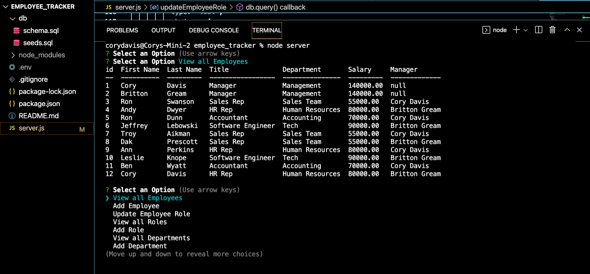

# Employee Tracker Application

### Project Creator
Cory Davis

## Description
This command line application is a content management system that assists with managing a companies employee database. To launch the application, simply enter `node server` while at the root of the directory and the user will be prompted with a series of commands to execute - (view all departments, view all roles, view all employees, add a department, add a role, add an employee, and update an employee role). Use the arrow keys to choose which to execute and then follow the prompts to until completed.

## Link to GitHub Repository
https://github.com/cmd0160/employee_tracker

## Link to Video Demonstration

https://watch.screencastify.com/v/gkbRK4vhLSQDGSWgaeGe

## Application Home Page

